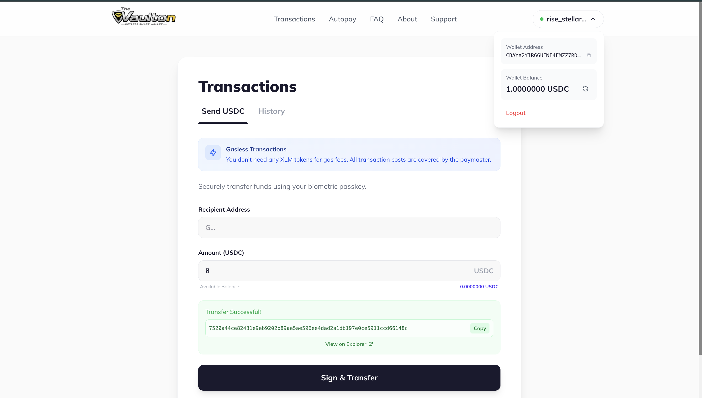
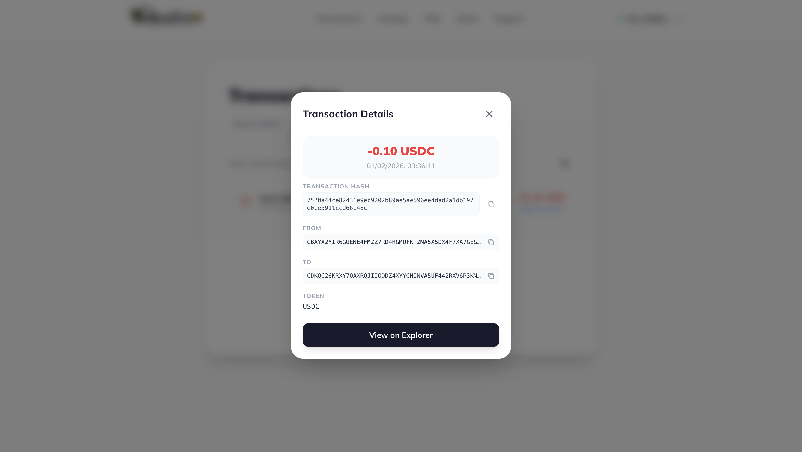
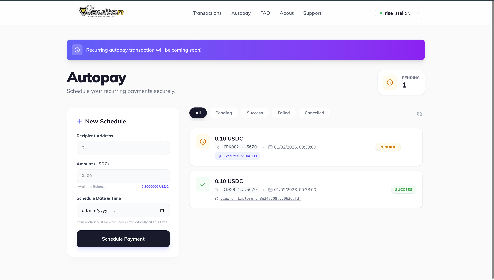
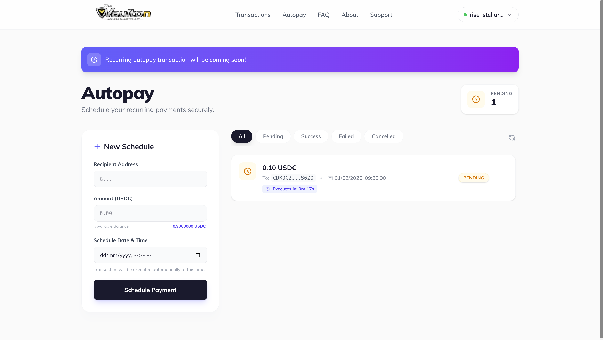
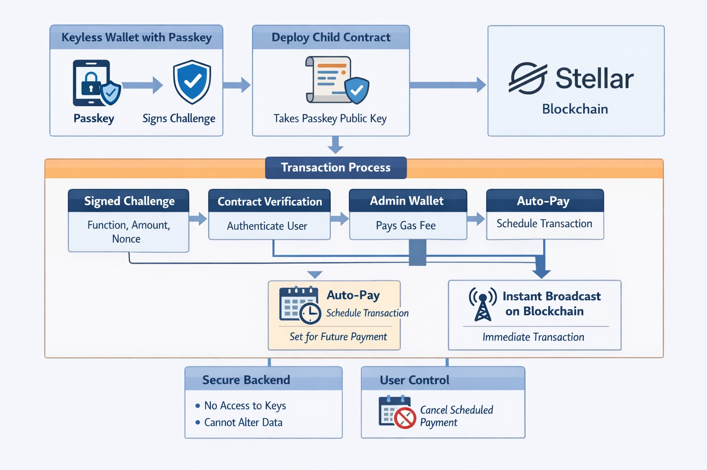

# Vaulton: The Ultimate Keyless Wallet

Vaulton is a biometric-first keyless wallet designed to bridge the gap between traditional ease-of-use and blockchain security. By leveraging **Passkey** technology and **Account Abstraction on Stellar**, we eliminate the need for complex seed phrases, making crypto transactions as simple as a biometric scan.

**[Deployed Application](https://vaulton.dahiya.xyz)** &nbsp; | &nbsp; **[Demo Video](https://drive.google.com/drive/folders/1eFbqI7CRDNlm7uSZzF6VR2g8OJ9Y4m5W?usp=sharing)**  | &nbsp; **[User Feedbacks](https://docs.google.com/spreadsheets/d/1DTHVyFAaIImpPmwJlRv0SLjxLnSA5DHz-YhQwVssbd4/edit?usp=sharing)** 

## Project Overview
Vaulton is a Web3 self-custody wallet that prioritizes user experience without compromising security. It allows users to onboard using their device's native biometrics (Face ID, Touch ID, or Windows Hello) to create a smart contract-based account on the Stellar network. It uniquely features an Autopay system for scheduled transactions that operates without the platform needing to control, manupulate, or access user-sensitive information, ensuring privacy-preserving automation.

### What it Solves
1.  **Seed Phrase Barrier**: Eliminates the risk of losing private keys or seed phrases.
    
2.  **Onboarding Friction**: Users can create a wallet in seconds with a biometric scan.
3.  **Complex Transaction Signing**: Every transaction is signed using hardware-level secure enclaves (Secure Enclave on Mac/iOS).
    
    
4.  **Gas Management**: Implements a Paymaster-based gasless experience, so users don't need to hold XLM for fees.
5.  **Payment Automation**: Introduces "Immutable Autopay" for hands-free scheduled transactions.
    
    

### How it Solves it
1.  **True Biometric Freedom**: Instead of remembering strings of words, you simply use what you already have—your face or fingerprint—to secure and access your funds instantly.
2.  **Autonomous Scheduling**: You can set up recurring payments once and trust the system to handle them exactly as planned, without ever handing over control of your wallet or personal data to us.
3.  **Frictionless Economy**: By removing the need to manage network tokens (XLM), we allow you to focus entirely on your transactions using the currencies you actually care about, like USDC.
4.  **Privacy-First Automation**: Our system acts as an automated assistant that follows your pre-approved instructions. It executes your scheduled payments precisely when needed, but it never has "keys to the house"—your privacy and security remain entirely in your hands.

---

## Tech Architecture Overview
Vaulton's architecture is designed to provide a secure, seamless, and gasless experience by combining modern web technologies with Stellar's robust blockchain infrastructure.



---

## Tech Stack
- **Frontend**: [Next.js 16](https://nextjs.org/) (App Router), React 19.
- **Styling & Animation**: [Tailwind CSS 4](https://tailwindcss.com/), [Framer Motion](https://www.framer.com/motion/).
- **Authentication**: [WebAuthn / Passkeys](https://webauthn.guide/).
- **Blockchain Interface**: Stellar Network (Optimized for USDC).
- **PWA**: [next-pwa](https://www.npmjs.com/package/next-pwa) for a native app-like experience.
- **Backend**: Dedicated Node.js API for Smart Account orchestration and transaction relaying (Paymaster).

---

## Features & USPs
Vaulton is built on the principle of **"Biometric Citadel"**—security that is invisible yet impenetrable.

### 1. Biometric Citadel (Passkey Authentication)
Your biometrics are the only key. By using WebAuthn, we store no passwords or private keys on our servers. Your private key is securely managed by your device's hardware, ensuring only you can authorize transactions.

### 2. The Gasless Protocol
Vaulton leverages Stellar's account abstraction capabilities to provide a gasless experience. Transactions are covered by a background paymaster, allowing users to send USDC without worrying about holding base tokens (XLM) for network fees.

### 3. Immutable Autopay (Scheduled Transactions)
Set it and forget it. Our Autopay system allows you to schedule USDC payments for recurring bills or subscriptions. Once scheduled, the protocol handles the execution reliably.
> *"We cannot tamper with the transactions while the auto-pay system is making payments, ensuring absolute reliability."*

### 4. Native PWA Experience
Vaulton can be installed directly onto your mobile or desktop home screen as a Progressive Web App, providing a fast, full-screen interface without the need for an app store.

---

## User Flow
1.  **Onboarding**: Click "Get Started" and perform a biometric scan to register a new Smart Account.
2.  **Dashboard**: View your USDC balance and transaction history in a clean, minimalist interface.
3.  **Transact**: Send USDC to any wallet address. The transaction is authorized via a biometric scan and relayed gaslessly.
4.  **Autopay**: Schedule upcoming payments by setting a date and recipient. Manage your active, successful, and cancelled schedules in the dedicated log.
5.  **Support & FAQ**: Access instant support or browse our interactive FAQ for quick assistance.

---

## Local Setup & Installation

Follow these steps to run Vaulton on your local machine:

### Prerequisites
- Node.js (v20.x or higher recommended)
- npm or yarn

### Steps
1.  **Clone the Repository**
    ```bash
    git clone https://github.com/[Your-Username]/vaulton-fe.git
    cd vaulton-fe
    ```

2.  **Install Dependencies**
    ```bash
    npm install
    ```

3.  **Environment Configuration**
    Create a `.env` file in the root directory and add your backend API URL (optional if using default):
    ```env
    NEXT_PUBLIC_API_URL=https://vaulton-backend-f8c2dge3b7fwfch6.centralindia-01.azurewebsites.net
    ```

4.  **Run Development Server**
    ```bash
    npm run dev
    ```
    The application will be available at `http://localhost:3000`.

5.  **Build for Production**
    ```bash
    npm run build
    npm start
    ```

---

## Q&A / FAQs

**Q: Is Vaulton custodial?**
**A:** No. Vaulton is a self-custody wallet. Your keys are generated and stored in your device's Secure Enclave/TPM via Passkeys. We never have access to your keys.

**Q: Why use Stellar for this?**
**A:** Stellar offers lightning-fast settlement and robust support for stablecoins like USDC. Combined with our account abstraction layer, it provides the perfect infrastructure for global, gasless payments.

**Q: Can I use Vaulton on multiple devices?**
**A:** Yes. Since we use Passkeys, you can sync your credentials across your Apple iCloud or Google account devices, or add new biometric devices to your account profile.

---

## Security & Reliability
Vaulton is designed with a **Trust-Zero Architecture**. Every user interaction is cryptographically verified against the registered Passkey public key on-chain, ensuring that even if the UI or backend is compromised, your funds remain safe under your biometric control.

---

## Operational Readiness & Enhancements

### User Metrics Tracking
Vaulton already has clear product events that can be used for analytics, even though a dedicated analytics provider is not wired in yet. The most useful signals are:

- `DAU`: unique users completing passkey login or session restore within a 24-hour window.
- `Transactions`: sent/received USDC activity from the transaction history screens and `/transactions` API.
- `Retention`: repeat logins, recurring Autopay usage, and return visits to the dashboard or SDK docs.
- `Feature adoption`: usage of registration, login, support tickets, and add-on modules such as anonymous payments and streaming partnerships.

These events map directly to the current app flows in `src/app/dashboard/page.js`, `src/app/dashboard/transactions/page.js`, `src/app/components/app/AutopayHub.js`, and `src/services/backendservice.js`.

### Security Checklist Completion
The current release checklist should be tied to the actual wallet flows in the product:

- Passkey registration, discoverable login, and logout.
- Session restore from local storage/session state.
- Smart account deployment after successful registration.
- Gasless USDC transfer signing and backend relay.
- Scheduled transaction create, fetch, and cancel flows.
- Health check availability through the backend `/health` endpoint.

The checklist also covers browser-side security expectations such as WebAuthn-only authentication, no server-side key custody, and safe handling of the passkey challenge payloads.

### Production Monitoring and Logging
The app currently uses `console.log` and `console.error` in auth, deployment, and transaction flows, which is useful during development but not enough for production operations. The highest-value monitoring targets are:

- Authentication failures in `/auth/register/*` and `/auth/login/*`.
- Smart account deployment failures in `/wallet/deploy`.
- Balance and transaction history fetch errors.
- Autopay scheduling/cancelation failures.
- Backend health and paymaster availability.

The existing `checkHealth()` helper in `src/services/backendservice.js` gives a natural readiness signal, while centralized logging would make backend and relay issues much easier to diagnose.

### Technical Documentation and User Guide
This repo already includes several documentation entry points that should be kept in sync:

- The top-level `README.md` for product and setup context.
- `src/app/sdk-docs/page.js` for the browser-based SDK usage guide.
- `vaulton-sdk/README.md` for package-level API documentation.
- `vaulton-sdk/examples/nextjs-wallet-demo` for a working integration example.

A user guide should cover the practical flows a user performs in Vaulton: sign up with a passkey, log in, send USDC, review transaction history, and manage Autopay schedules.

### Advanced Features Implementation
The codebase already contains the foundation for a few advanced modules beyond the core wallet:

- `AnonymousPaymentHub`: private payment flows built around ZKP-based stealth addresses.
- `StreamingPartnershipHub`: creator tipping and real-time micro-payment support.
- `AddonsScreen`: the place where active, live, and roadmap add-ons are surfaced to users.
- `AI Agent` support is already positioned in the UI as a coming-soon capability for natural-language wallet actions.

These features extend Vaulton from a simple wallet into a broader payment and automation platform without changing the passkey-first model.

---

## Future Plans & Scope
Vaulton is committed to evolving beyond a simple wallet into a comprehensive financial ecosystem. Our roadmap includes several ambitious features designed to further democratize access to decentralized finance:

- **Multi-Chain Expansion & Interoperability**: While we currently offer a gasless experience exclusively on the **Stellar Network**, our vision includes allowing users to create and manage smart accounts across multiple blockchains. The core "Keyless" biometric experience will remain consistent, regardless of the underlying network.
- **Cross-Chain Bridging & Borrowing**: We plan to integrate native bridging protocols to allow seamless asset movement across different chains. Furthermore, users will eventually be able to access decentralized borrowing markets, leveraging their assets for liquidity without compromising on security.
- **Smart Staking Aggregator with Rebalancing**: To help users maximize their returns, we will implement a staking aggregator that identifies the best yields across the DeFi landscape. This will feature automated rebalancing to ensure assets are always allocated to the most efficient and secure protocols.

---
